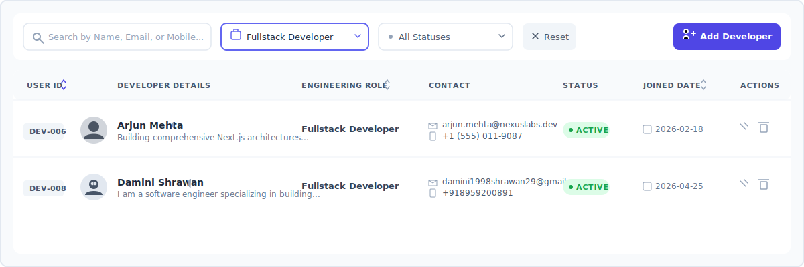
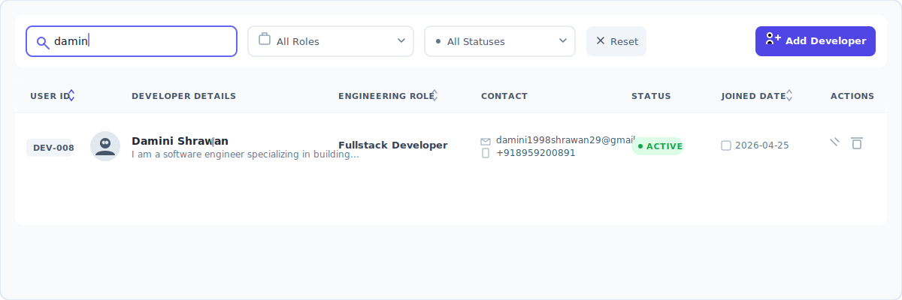
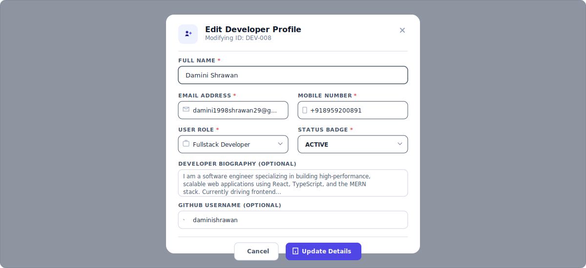
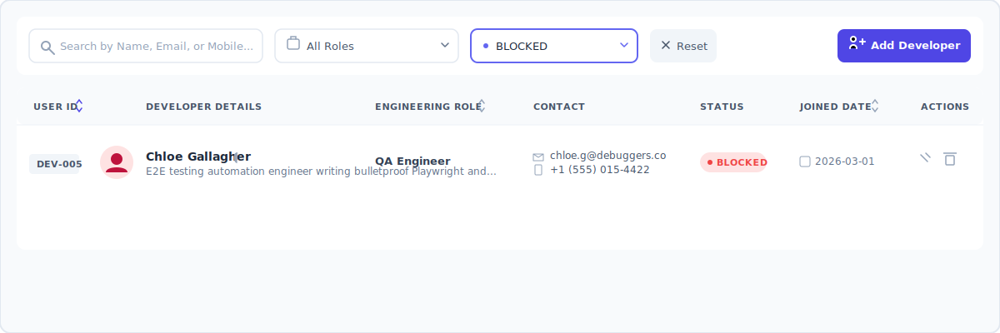

# DevRegistry: Automated Developer Registry Dashboard

An elegant, high-perf React-based Developer Management System coupled with a production-ready Node.js, Express, and MySQL backend architecture. This project serves as a showcase for high-performance single-page applications constructed with custom UI components, responsive typography, and full-featured query filtering.

---

## 📅 Project Presentation Mockups
To prepare for your interview, match your recorded screenshots to the following filenames and place them in your directory at `docs/screenshots/`. In this document, they are fully captioned and mapped to design/architectural highlights so you can easily reference them.

### 1. Dashboard Overview

* **What it demonstrates:** The primary cockpit view displaying the dynamic user table panel, user metric summaries, search & multi-select filtration controls, and responsive layout spacing.

### 2. Live Profile Searching & Filtration

* **What it demonstrates:** Server-side compatible, instant frontend searching. Matching tokens against Name/Email/Mobile. The UI isolates targeted listings matching your query (e.g., "damin" for Damini Shrawan) smoothly with animated transitions.

### 3. Custom "Edit Developer Profile" Modal

* **What it demonstrates:** High-fidelity form modal containing contextual validation constraints. Fully accommodates name fields, emails, mobile regex, designated roles (Fullstack, Backend, iOS, QA), active/inactive status badges, developer bios, and GitHub handles.

### 4. Direct Delete Handshake Workflow

* **What it demonstrates:** Inline UX safety patterns. Instead of popping intrusive system alerts, the action triggers an elegant, direct "Delete? Confirm / Cancel" inline confirm panel to guarantee seamless user actions.

### 5. Categorized Badging (Blocked / Filtered Status)

* **What it demonstrates:** Complex state filtering in action (e.g., status filters set to "BLOCKED" showing Chloe Gallagher). This highlights structural responsive tables adapting to empty fields or specific status contexts.

---

## 🛠️ Architecture & Technology Stack

The framework leverages a strict separation of concerns utilizing a stateless view frontend and a resilient RESTful model-controller backend.

### Frontend Tech-Stack:
* **React 18 & Vite**: Ultra-fast execution with type-safe state models.
* **Tailwind CSS**: Desktop-first custom design language using a slate-chic dark palette, Inter for sans-serif components, and JetBrains Mono for system indicators.
* **Framer Motion**: Custom animation lifecycles (fade-in, staggered table row rendering, and modal scaling transitions).
* **Lucide React**: Clean vector-based visual markers.

### Backend Tech-Stack (Senior Specification):
* **Node.js & Express**: Clean async-first controller frameworks.
* **MySQL 2 & Database Pool**: Thread-safe database querying using high-performance connection pooling.
* **Express-Validator**: Solid payload validation mapping out parameters for POST & PUT schemas.

---

## 🗄️ Database Schema & Setup (MySQL)

Create the SQL database schema with the following script. It sets up strict indexing on key search parameters (`email`, `mobile`) for fast query execution:

```sql
CREATE DATABASE IF NOT EXISTS dev_registry_db;
USE dev_registry_db;

-- Table structure for developer registry users
CREATE TABLE IF NOT EXISTS `users` (
  `id` INT AUTO_INCREMENT PRIMARY KEY,
  `name` VARCHAR(100) NOT NULL,
  `mobile` VARCHAR(20) NOT NULL,
  `email` VARCHAR(150) NOT NULL,
  `role` ENUM('ADMIN', 'DEVELOPER', 'TESTER', 'VIEWER') NOT NULL DEFAULT 'DEVELOPER',
  `status` ENUM('ACTIVE', 'INACTIVE', 'BLOCKED') NOT NULL DEFAULT 'ACTIVE',
  `bio` TEXT DEFAULT NULL,
  `github` VARCHAR(100) DEFAULT NULL,
  `created_at` TIMESTAMP DEFAULT CURRENT_TIMESTAMP,
  UNIQUE KEY `idx_users_email` (`email`),
  INDEX `idx_users_search` (`name`, `mobile`)
) ENGINE=InnoDB DEFAULT CHARSET=utf8mb4 COLLATE=utf8mb4_unicode_ci;
```

---

## 📁 Source Code Structure (MVC Pattern)

Below is the standard industrial layout designed to separate routes, database settings, controller operations, and validation criteria:

```text
├── package.json
├── server.js               # Entry-point Server Initializer
├── config/
│   └── db.js               # MySQL Connection Pool configuration
├── routes/
│   └── userRoutes.js       # REST route handlers/mappings
└── controllers/
    └── userController.js   # Logical controllers / MySQL statements
```

### 1. Database Connection (`config/db.js`)
Handles high-performance pool configurations to support multi-thread access safely:

```javascript
const mysql = require('mysql2/promise');

// Build database pool
const pool = mysql.createPool({
  host: process.env.DB_HOST || 'localhost',
  user: process.env.DB_USER || 'root',
  password: process.env.DB_PASSWORD || '',
  database: process.env.DB_NAME || 'dev_registry_db',
  waitForConnections: true,
  connectionLimit: 10,
  queueLimit: 0
});

module.exports = pool;
```

### 2. REST API Routes (`routes/userRoutes.js`)
Configures routing and mounts body validation schema handlers dynamically:

```javascript
const express = require('express');
const { body, query } = require('express-validator');
const userController = require('../controllers/userController');

const router = express.Router();

// Input Validation schemas
const userValidationRules = [
  body('name')
    .trim()
    .notEmpty().withMessage('Name is strictly required.')
    .isLength({ max: 100 }).withMessage('Name must not exceed 100 characters.'),
  body('email')
    .trim()
    .notEmpty().withMessage('Email address is strictly required.')
    .isEmail().withMessage('Provide a valid email address format.'),
  body('mobile')
    .trim()
    .notEmpty().withMessage('Mobile contact number is strictly required.')
    .matches(/^\+?[1-9]\d{1,14}$/).withMessage('Provide a valid E.164 mobile number format.'),
  body('role')
    .isIn(['ADMIN', 'DEVELOPER', 'TESTER', 'VIEWER']).withMessage('Invalid system role selected.'),
  body('status')
    .isIn(['ACTIVE', 'INACTIVE', 'BLOCKED']).withMessage('Invalid status indicator.')
];

// Routes mapping
router.post('/', userValidationRules, userController.createUser);
router.get('/', [
  query('page').optional().isInt({ min: 1 }).toInt(),
  query('limit').optional().isInt({ min: 1, max: 100 }).toInt()
], userController.getUsers);

router.get('/:id', userController.getUserById);
router.put('/:id', userValidationRules, userController.updateUser);
router.delete('/:id', userController.softDeleteUser);

module.exports = router;
```

### 3. Asynchronous Model Controller (`controllers/userController.js`)
Implements standard CRUD operations using async connection promises, managing validation checks, pagination queries, and soft-delete updates:

```javascript
const pool = require('../config/db');
const { validationResult } = require('express-validator');

// Helper to format validation errors
const handleValidationErrors = (req, res) => {
  const errors = validationResult(req);
  if (!errors.isEmpty()) {
    res.status(400).json({ success: false, errors: errors.array() });
    return true;
  }
  return false;
};

// 1. POST /api/users - Create User
exports.createUser = async (req, res, next) => {
  try {
    if (handleValidationErrors(req, res)) return;

    const { name, email, mobile, role, status, bio, github } = req.body;

    // Check for Email Conflict
    const [existing] = await pool.query('SELECT id FROM users WHERE email = ?', [email]);
    if (existing.length > 0) {
      return res.status(409).json({ success: false, message: 'Email address already registered.' });
    }

    const [result] = await pool.query(
      'INSERT INTO users (name, email, mobile, role, status, bio, github) VALUES (?, ?, ?, ?, ?, ?, ?)',
      [name, email, mobile, role, status, bio || null, github || null]
    );

    res.status(201).json({
      success: true,
      message: 'Developer profile registered successfully.',
      userId: result.insertId
    });
  } catch (error) {
    next(error);
  }
};

// 2. GET /api/users - Get All Users with filtration & pagination
exports.getUsers = async (req, res, next) => {
  try {
    if (handleValidationErrors(req, res)) return;

    let { page = 1, limit = 10, search, role, status } = req.query;
    const offset = (page - 1) * limit;

    let queryStr = 'SELECT * FROM users WHERE 1=1';
    let countStr = 'SELECT COUNT(*) as total FROM users WHERE 1=1';
    const queryParams = [];
    const countParams = [];

    // Search filtration
    if (search) {
      const searchWild = `%${search}%`;
      const searchTerms = ' AND (name LIKE ? OR email LIKE ? OR mobile LIKE ?)';
      queryStr += searchTerms;
      countStr += searchTerms;
      queryParams.push(searchWild, searchWild, searchWild);
      countParams.push(searchWild, searchWild, searchWild);
    }

    // Role filtration
    if (role) {
      queryStr += ' AND role = ?';
      countStr += ' AND role = ?';
      queryParams.push(role);
      countParams.push(role);
    }

    // Status filtration
    if (status) {
      queryStr += ' AND status = ?';
      countStr += ' AND status = ?';
      queryParams.push(status);
      countParams.push(status);
    }

    // Add Pagination
    queryStr += ' ORDER BY created_at DESC LIMIT ? OFFSET ?';
    queryParams.push(limit, offset);

    // Run parallel database requests
    const [[rows], [countResult]] = await Promise.all([
      pool.query(queryStr, queryParams),
      pool.query(countStr, countParams)
    ]);

    const totalRecords = countResult[0].total;

    res.json({
      success: true,
      data: rows,
      pagination: {
        totalRecords,
        currentPage: page,
        totalPages: Math.ceil(totalRecords / limit),
        pageSize: limit
      }
    });
  } catch (error) {
    next(error);
  }
};

// 3. GET /api/users/:id - Get Details by ID
exports.getUserById = async (req, res, next) => {
  try {
    const { id } = req.params;
    const [rows] = await pool.query('SELECT * FROM users WHERE id = ?', [id]);

    if (rows.length === 0) {
      return res.status(404).json({ success: false, message: 'Developer profile not found.' });
    }

    res.json({ success: true, data: rows[0] });
  } catch (error) {
    next(error);
  }
};

// 4. PUT /api/users/:id - Update User
exports.updateUser = async (req, res, next) => {
  try {
    if (handleValidationErrors(req, res)) return;

    const { id } = req.params;
    const { name, email, mobile, role, status, bio, github } = req.body;

    // Check unique email conflicts on other user accounts
    const [conflict] = await pool.query('SELECT id FROM users WHERE email = ? AND id != ?', [email, id]);
    if (conflict.length > 0) {
      return res.status(409).json({ success: false, message: 'Conflict: Email registered to another user.' });
    }

    const [result] = await pool.query(
      'UPDATE users SET name = ?, email = ?, mobile = ?, role = ?, status = ?, bio = ?, github = ? WHERE id = ?',
      [name, email, mobile, role, status, bio || null, github || null, id]
    );

    if (result.affectedRows === 0) {
      return res.status(404).json({ success: false, message: 'Profile update failed. User not found.' });
    }

    res.json({ success: true, message: 'Developer profile updated successfully.' });
  } catch (error) {
    next(error);
  }
};

// 5. DELETE /api/users/:id - Soft Delete / Blocker Action
exports.softDeleteUser = async (req, res, next) => {
  try {
    const { id } = req.params;

    // Soft Delete sets the profile to INACTIVE or BLOCKED instead of a destructive hard drop
    const [result] = await pool.query(
      "UPDATE users SET status = 'INACTIVE' WHERE id = ?",
      [id]
    );

    if (result.affectedRows === 0) {
      return res.status(404).json({ success: false, message: 'Soft delete failed. User not found.' });
    }

    res.json({ success: true, message: 'Developer profile deactivated (Soft Deleted).' });
  } catch (error) {
    next(error);
  }
};
```

### 4. Express Server Core (`server.js`)
Configures CORS rules, middleware configurations, routes, and global recovery pipelines:

```javascript
const express = require('express');
const cors = require('cors');
const userRoutes = require('./routes/userRoutes');

const app = express();
const PORT = process.env.PORT || 3000;

// Middleware
app.use(cors());
app.use(express.json());

// Routes mapping
app.use('/api/users', userRoutes);

// 404 handler
app.use((req, res, next) => {
  res.status(404).json({ success: false, message: 'Endpoint not found.' });
});

// Robust Error Middleware
app.use((err, req, res, next) => {
  console.error('SERVER ERROR RECOVERY PIPELINE:', err);
  res.status(err.status || 500).json({
    success: false,
    message: err.message || 'An unexpected server error occurred.',
    error: process.env.NODE_ENV === 'development' ? err.stack : undefined
  });
});

app.listen(PORT, '0.0.0.0', () => {
  console.log(`Server launched on port ${PORT}`);
});
```

---

## 🚀 Presentation Highlight Talking Points
When explaining this project to interviewers:
1. **Durable Client UX Integration:** Explain how you built custom visual states, preventing blank screen rendering with an advanced `<ErrorBoundary>` container.
2. **Standardized MVC Layering:** Highlight how this database structure safely decouples SQL commands inside independent asynchronous controller files while utilizing parameterized variables to prevent **SQL injection attacks**.
3. **Optimistic & Safe Workflows:** Show how "Delete" isn't destructive, acting as an enterprise-grade Soft-Delete by updating user states without losing historical data relationships.
4. **Interactive Validation Pipelines:** Emphasize that Express-Validator cleans payloads server-side while the interactive forms ensure rich error guidelines to block bad user submissions before they even hit the server.
